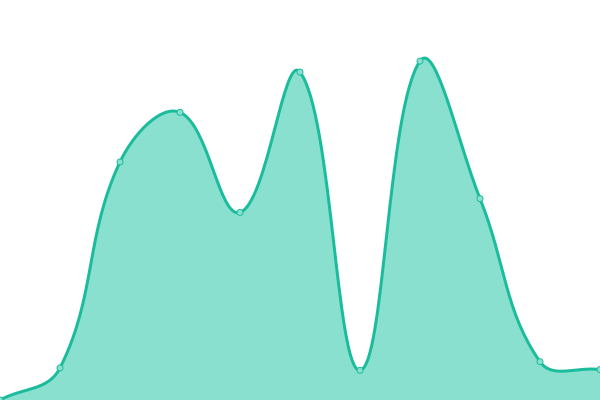
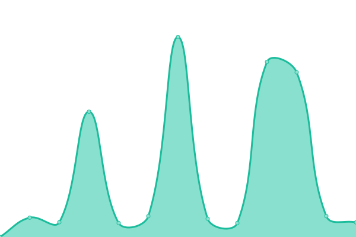

# [📈 Live Status](https://torrentpier.github.io/upptime): <!--live status--> **🟩 All systems operational**

This repository contains the open-source uptime monitor and status page for [TorrentPier](https://torrentpier.com/), powered by [Upptime](https://github.com/upptime/upptime).

With [Upptime](https://upptime.js.org), you can get your own unlimited and free uptime monitor and status page, powered entirely by a GitHub repository. We use [Issues](https://github.com/torrentpier/upptime/issues) as incident reports, [Actions](https://github.com/torrentpier/upptime/actions) as uptime monitors, and [Pages](https://torrentpier.github.io/upptime) for the status page.

<!--start: status pages-->
<!-- This summary is generated by Upptime (https://github.com/upptime/upptime) -->
<!-- Do not edit this manually, your changes will be overwritten -->
<!-- prettier-ignore -->
| URL | Status | History | Response Time | Uptime |
| --- | ------ | ------- | ------------- | ------ |
|  [TorrentPier Forum](https://torrentpier.com) | 🟩 Up | [torrent-pier-forum.yml](https://github.com/torrentpier/upptime/commits/HEAD/history/torrent-pier-forum.yml) | 

 1213ms
     
 | 

<a href="https://torrentpier.github.io/upptime/history/torrent-pier-forum">100.00%</a>
    

|  [TorrentPier Download Center](https://get-torrentpier.duckdns.org) | 🟩 Up | [torrent-pier-download-center.yml](https://github.com/torrentpier/upptime/commits/HEAD/history/torrent-pier-download-center.yml) | 

 3228ms
     
 | 

<a href="https://torrentpier.github.io/upptime/history/torrent-pier-download-center">98.93%</a>
    

|  [TorrentPier Demo](https://torrentpier.duckdns.org) | 🟩 Up | [torrent-pier-demo.yml](https://github.com/torrentpier/upptime/commits/HEAD/history/torrent-pier-demo.yml) | 

 1987ms
     
 | 

<a href="https://torrentpier.github.io/upptime/history/torrent-pier-demo">98.81%</a>
    

|  [TorrentPier Archive](https://archive-torrentpier.duckdns.org) | 🟩 Up | [torrent-pier-archive.yml](https://github.com/torrentpier/upptime/commits/HEAD/history/torrent-pier-archive.yml) | 

 3064ms
     
 | 

<a href="https://torrentpier.github.io/upptime/history/torrent-pier-archive">99.36%</a>
    

<!--end: status pages-->

[**Visit our status website →**](https://torrentpier.github.io/upptime)

## 📄 License

- Powered by: [Upptime](https://github.com/upptime/upptime)
- Code: [MIT](./LICENSE) © [Anand Chowdhary](https://anandchowdhary.com), supported by [Pabio](https://pabio.com)
- Data in the `./history` directory: [Open Database License](https://opendatacommons.org/licenses/odbl/1-0/)
